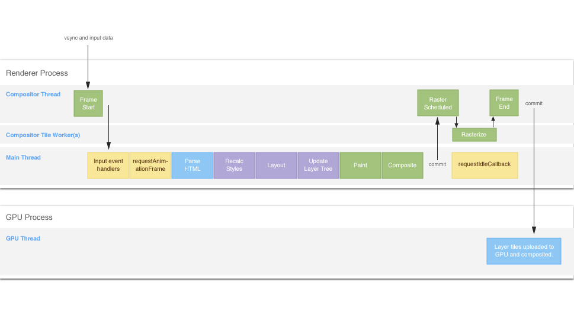

React还有一个大部分，在前面的流程中我们忽略过的，就是关于react的调度。但是要讲清调度，需要的前置知识比较多，先看一下里面用的和浏览器工作原理的api

`requestAnimationFrame`
`requestIdleCallback`
`MessageChannel`

可能用过一些，但对于真实的区别和用法，估计能理清的不多。而react的调度，恰恰用的是这几个api里的精髓部分，所以花一章彻底搞清楚他们的区别和用处，是非常有价值的

### 先讲浏览器的帧渲染

内容出自[参考文章](https://juejin.im/post/6844903808762380296)

*开局一张图，内容全靠编*



## 进程

* **渲染进程**。包裹标签页的容器。包含了多个线程，这些线程一起负责了页面显示到屏幕上的各个方面。这些线程有合成线程（Compositor），图块栅格化线程（Tile Worker），和主线程(Main)。
* **GPU 进程**。这是一个单一的进程，为所有标签页和浏览器周边进程服务。当帧被提交时，GPU 进程会将分为图块的位图和其他数据（比如四边形顶点和矩阵）上传到 GPU 中，真正将像素显示到屏幕上。GPU 进程只有一个的线程，叫 GPU 线程，实际上是它做了这些工作。


## 渲染进程中的线程

- **合成线程（Compositor Thread）**。这是最先被告知垂直同步事件（vsync event，操作系统告知浏览器刷新一帧图像的信号）的线程。它接收所有的输入事件。如果可能，合成线程会避免进入主线程，自己尝试将输入的事件（比如滚动）转换为屏幕的移动。它会更新图层的位置，并经由 GPU 线程直接向 GPU 提交帧来完成这个操作。如果输入事件需要进行处理，或者有其他的显示工作，它将无法直接完成该过程，这就需要主线程了。

- **主线程**。在这里浏览器执行我们熟知和喜欢的那些任务：JavaScript，样式，布局和绘制。（这一点以后会变化，有了 Houdini，我们可以在合成线程中运行一些代码）主线程荣获“最容易导致 jank 奖”，很大程度上是因为它要做的事情太多了这个事实。（译注：jank 指页面内容抖动卡顿，由于页面内容的更新频率跟不上屏幕刷新频率导致）

- **合成图块栅格化线程（Compositor Tile Worker）**。由合成线程派生的一个或多个线程，用于处理栅格化任务。我们稍后再讨论。

这里面主线程的流程看起来最多，但是我们应该注意的是合成线程，也叫排版线程，就是Compositor Thread。因为它全权负责启动主线程工作，并将帧运送到屏幕上。如果不需要经过输入事件，排版线程可以直接把帧发送给GPU进程


### 主线程Main Thread

首先明确一点，上面图片里主线程里的所有步骤，**并不是必须的**。所以由此引申而来的关于渲染的最佳优化方式就是 -- **减少其中的步骤**。 这里很容易联想到常见的面试问题：*重排*和*重绘*。参考[谷歌文档](https://developers.google.com/web/fundamentals/performance/rendering/#the-pixel-pipeline)


图中 RecalcStyles 和 Layout 下方指向 requestAnimationFrame 的红色箭头。在代码中恰好触发这两个情况是完全可能的。这种情况叫做强制同步布局（或强制同步样式，Forced Synchronous Layout 和 Forced Synchronous Styles），通常于性能不利。参考文章[避免大型、复杂的布局和布局抖动](https://developers.google.com/web/fundamentals/performance/rendering/avoid-large-complex-layouts-and-layout-thrashing#avoid-forced-synchronous-layouts)。以及文章[诊断强制同步布局](https://developers.google.com/web/tools/chrome-devtools/rendering-tools/forced-synchronous-layouts?hl=zh-cn)。这两篇文章很清楚的讲到了在代码层面上，对于浏览器渲染造成的性能浪费，以及优化点。

主线程分解：

1. **开始新的一帧**。垂直同步信号触发，开始渲染新的一帧图像。


2. **输入事件的处理**。从合成线程将输入的数据，传递到主线程的事件处理函数。所有的事件处理函数（touchmove，scroll，click）都应该最先触发，每帧触发一次，但也不一定这样；调度程序会尽力尝试，但是是否真的每帧触发因操作系统而异。从用户交互事件，到事件被交付主线程，二者之间也存在延迟。


3. **requestAnimationFrame**。这是更新屏幕显示内容的理想位置(DOM操作)，因为现在有全新的输入数据，又非常接近即将到来的垂直同步信号。其他的可视化任务，比如样式计算，因为是在本次任务之后，所以现在是变更元素的理想位置。如果你改变了 —— 比如说 100 个类的样式，这不会引起 100 次样式计算；它们会在稍后被批量处理。唯一需要注意的是，不要查询进行计算才能得到的样式或者布局属性（比如 el.style.backgroundImage 或 el.style.offsetWidth）。如果你这样做了，会导致重新计算样式，或者布局，或者二者都发生，进一步导致强制同步布局，乃至布局颠簸。


4. **解析 HTML**（Parse HTML）。处理新添加的 HTML，创建 DOM 元素。在页面加载过程中，或者进行 appendChild 操作后，你可能看到更多的此过程发生。


5. **重新计算样式**（Recalc Styles）。为新添加或变更的内容计算样式。可能要计算整个 DOM 树，也可能缩小范围，取决于具体更改了什么。例如，更改 body 的类名影响可能很大，但是值得注意的是浏览器已经足够智能了，可以自动限制重新计算样式的范围。


6. **布局**（Layout）。计算每个可见元素的几何信息（每个元素的位置和大小）。一般作用于整个文档，计算成本通常和 DOM 元素的大小成比例。


7. **更新图层树**（Update Layer Tree）。这一步创建层叠上下文，为元素的深度进行排序。


8. **绘制**Paint。过程分为两步：第一步，对所有新加入的元素，或进行改变显示状态的元素，记录 draw 调用（这里填充矩形，那里写点字）；第二步是栅格化（Rasterization，见后文），在这一步实际执行了 draw 的调用，并进行纹理填充。Paint 过程记录 draw 调用，一般比栅格化要快，但是两部分通常被统称为“painting”。


9. **合成**（Composite）：图层和图块信息计算完成后，被传回合成线程进行处理。这将包括 will-change(transform加速)、重叠元素和硬件加速的 canvas 等。


10. **栅格化规划**（Raster Scheduled）和**栅格化**（Rasterize）：在 Paint 任务中记录的 draw 调用现在执行。过程是在合成图块栅格化线程（Compositor Tile Workers）中进行，线程的数量取决于平台和设备性能。例如，在 Android 设备上，通常有一个线程，而在桌面设备上有时有 4 个。栅格化根据图层来完成，每层都被分成块。


11. **帧结束**：各个层的所有的块都被栅格化成位图后，新的块和输入数据（可能在事件处理程序中被更改过）被提交给 GPU 线程。


12. **发送帧**：最后，但同样很重要的是，图块被 GPU 线程上传到 GPU。GPU 使用四边形和矩阵（所有常用的 GL 数据类型）将图块 draw 在屏幕上。

### MessageChannel

这里只讲一下port接受消息的时机，是在**每一帧的paint工作之后**

```js
const channel = new MessageChannel()
channel.port1.onmessage = function(){}    // 在每一帧paint工作之后触发
```

### requestIdleCallback

讲完了帧流程，这里就可以引入`requestIdleCallback`了

[MDN文档](https://developer.mozilla.org/zh-CN/docs/Web/API/Window/requestIdleCallback)

> var handle = window.requestIdleCallback(callback[, options])

- callback
  一个在事件循环空闲时即将被调用的函数的引用。函数会接收到一个名为 IdleDeadline 的参数，这个参数可以获取当前空闲时间以及回调是否在超时时间前已经执行的状态。
- options 可选
  包括可选的配置参数。具有如下属性：
    - timeout：如果指定了timeout并具有一个正值，并且尚未通过超时毫秒数调用回调，那么回调会在下一次空闲时期被强制执行，尽管这样很可能会对性能造成负面影响。

在帧结束时，如果还有时间，可以通过`requestIdleCallback(doSth)`的方式，在当前帧的剩余时间内调用。


当然，**并不是没一帧都会有剩余时间**，所以如果期望每帧都触发的事件，不能写在这个回调里。另外，同上面讲的渲染进程的优化，**不要在这里面对布局进行读写操作**，真正对DOM的操作应该放在`requestAnimationFrame`里，在下一帧进行触发

代码片段

```js
function processPendingElements (deadline) {

  // If there is no deadline, just run as long as necessary.
  if (typeof deadline === 'undefined')
    deadline = { timeRemaining: function () { return Number.MAX_VALUE } };

  if (!documentFragment)
    documentFragment = document.createDocumentFragment();

  // Go for as long as there is time remaining and work to do.
  while (deadline.timeRemaining() > 0 && elementsToAdd.length > 0) {

    // Create the element.
    var elToAdd = elementsToAdd.pop();
    var el = document.createElement(elToAdd.tag);
    el.textContent = elToAdd.content;

    // Add it to the fragment.
    documentFragment.appendChild(el);

    // Don't append to the document immediately, wait for the next
    // requestAnimationFrame callback.
    scheduleVisualUpdateIfNeeded();
  }

  // Check if there are more events still to send.
  if (elementsToAdd.length > 0)
    scheduleElementCreation();
}

function scheduleVisualUpdateIfNeeded() {

  if (isVisualUpdateScheduled)
    return;

  isVisualUpdateScheduled = true;

  requestAnimationFrame(appendDocumentFragment);
}

function appendDocumentFragment() {
  // Append the fragment and reset.
  document.body.appendChild(documentFragment);
  documentFragment = null;
}
```


### 常问问题（搬运）

- **是否有polyfill？** 遗憾的是没有，但是如果您想透明地重定向到，则可以使用ShimsetTimeout。该API之所以存在，是因为它填补了Web平台中非常真实的空白。推断缺乏活动是很困难的，但是没有JavaScript API可以确定帧结束时的空闲时间，因此充其量您必须做出猜测。诸如setTimeout，，setInterval或的API setImmediate可用于安排工作，但它们的时间安排得以避免避免以这种方式进行用户交互requestIdleCallback。

- **如果我超期了怎么办？** 如果timeRemaining()返回零，但是您选择运行更长的时间，则可以这样做，而不必担心浏览器会暂停工作。但是，浏览器为您提供了一个期限，以尝试确保用户的流畅体验，因此，除非有充分的理由，否则您应始终遵守该期限。

- **是否有timeRemaining()将返回的最大值？** 是的，目前是50毫秒。尝试维护响应式应用程序时，对用户交互的所有响应都应保持在100毫秒以下。在大多数情况下，如果用户与50ms窗口进行交互，则应允许空闲回调完成，并允许浏览器响应用户的交互。您可能会获得多个连续安排的空闲回调（如果浏览器确定有足够的时间运行它们）。

- **有什么我不应该在requestIdleCallback中做的工作吗？** 理想情况下，您所做的工作应该是具有相对可预测特征的小块（微任务）。例如，更改DOM尤其会导致执行时间无法预测，因为它将触发样式计算，布局，绘画和合成。因此，您仅应requestAnimationFrame按照上述建议在回调中进行DOM更改。另一件需要警惕的事情是解决（或拒绝）Promise，因为即使没有更多时间了，回调也会在空闲回调完成后立即执行。

- **我会总是requestIdleCallback在帧结束时得到一个吗？** 不，并非总是如此。只要在帧末尾或用户处于非活动状态时有空闲时间，浏览器就会安排回调。您不应该期望每帧调用一次回调，并且如果您要求它在给定的时间范围内运行，则应该利用超时。

- **我可以有多个requestIdleCallback回调吗？** 是的，您可以，因为可以有多个requestAnimationFrame回调。但是，值得记住的是，如果您的第一个回调用尽了其回调期间剩余的时间，那么将没有更多的时间可用于其他任何回调。然后，其他回调将必须等到浏览器下一次空闲后才能运行。根据您要完成的工作，最好有一个空闲的回调并在其中分配工作。另外，您可以利用超时来确保没有回调因时间而挨饿。

- **如果我在另一个内部设置了新的空闲回调，会发生什么？** 新的空闲回调将计划从下一个帧（而不是当前帧）开始尽快运行。